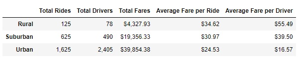
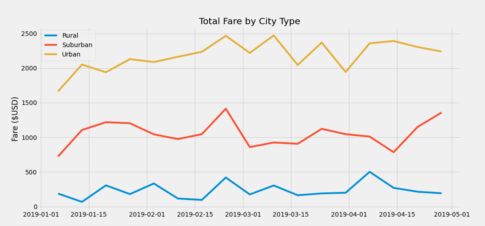

# PyBer_Challenge

## Overview of the analysis: 
Using the two .csv files profiled (see list) compile the information into one “main” dataframe which will be used to determine a variety of statistical information. 

* City_data.csv – Breakdown of specific cities in the dataset along with the PyBer drivers linked to each city. Each city also has a categorical breakdown of “Rural”, “Suburban”, & “Urban”
* Ride_data.csv – Breakdown of each ride given by a PyBer driver which corresponds to the cities listed in City_data.csv. The fare for the ride along with the specific “ride_id” is detailed. 

## Results: 
The data concludes that he Average Fare per ride for Rural drivers is higher than the drivers in the Urban area. The data indicates that the distance between the ride start and end locations are greater leading to a higher Fare cost vs the lower Average Fare per Ride in Urban areas. This leads to the conclusion that the distance between start and stops are much shorter making the average cost go down. In the middle were Suburban areas Fares in the middle. 
The Driver counts for Urban areas was almost 3 times as high vs Suburban drivers and over 10 times the amounts vs Rural drivers. 

## Summary: 
Using the included chart over the specific time period between 01/01/2019 to 04/29/2019 you can see total Fares for Urban provided the most revenue for PyBer. Additionally, Suburban locations came in second with Rural being the lowest revenue stream. 

## Possible ways to increase revenue for PyBer
* Increase the drivers located in Rural (or Suburban) areas. This can help drive more revenue linked to the increased distances traveled from the clients pick up and destination locations. 
* Start to track the "time between" a driver dropping off a client and the time he takes another. This can help determine driver saturation levels linked to a specific market type. If there is a long lead time between a driver in a Rural area to pick up another Client then this means there isn't a lot of rides needed. If the time between in a Urban area is very low then this implies that the area is busy and additional drivers could be encouraged to drive in this area. 
* Additional revenue can be increased by charging a "premium" rate based on high volume times. Morning and Evening rush hour times, Saturday nights, holidays, etc. A small increase in the per mile rate can increase the Average Fare per Ride for the Urban drivers.
